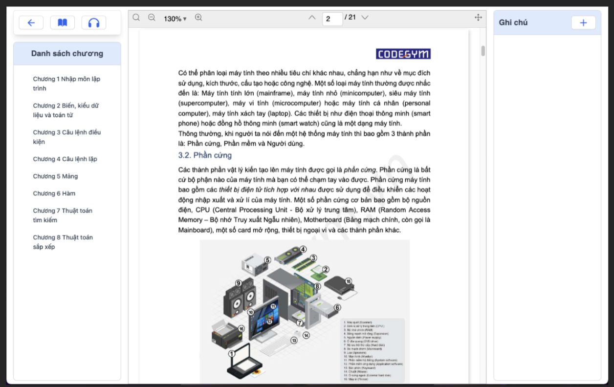

# Digital Library System

The Digital Library System is a comprehensive platform that facilitates book management, user engagement, and personalized reading experiences. This system offers:

- **Inventory and Statistics Management**: Efficiently track and manage book records.
- **Web and Mobile Applications**: Allow users to quickly search and access books in text and audio formats.
- **AI-Powered Recommendations**: Deliver personalized book suggestions tailored to user preferences.

---

## Project Links

- **Web Admin**: [Library Admin](https://github.com/nhan7tuoi/Library-Admin)
- **Web User**: [Library Web](https://github.com/nhan7tuoi/Library-Web)
- **Mobile App**: [Library App](https://github.com/NhatSang/Library-Project/tree/main/Frontend/library-app/Library)
- **Node.js Server**: [Library Server (Node.js)](https://github.com/NhatSang/Library-Project/tree/main/backup/library_server)
- **Python Server**: [Library Recommendation (Python)](https://github.com/NhatSang/Library-Project/tree/main/backup/library_recommendation)

### Contributors

- **Pham Duc Nhan (BE & FE)**: [GitHub Profile](https://github.com/nhan7tuoi)
- **Nguyen Nhat Sang (BE & FE)**: [GitHub Profile](https://github.com/NhatSang)

---

## System Architecture

---

## UI Showcase

### Mobile App

  
  
  

---

### Web Admin

  
  

---

### Web User

  
  
  

---

